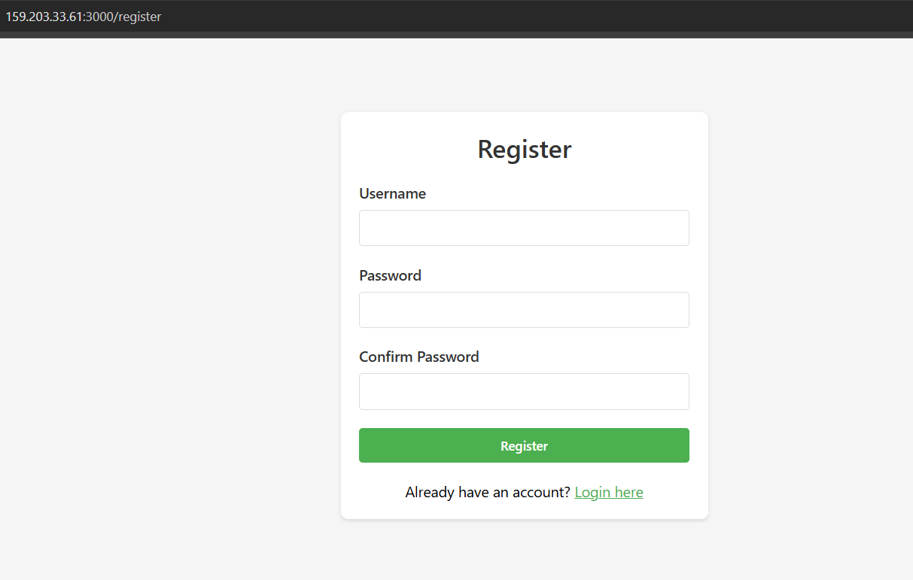
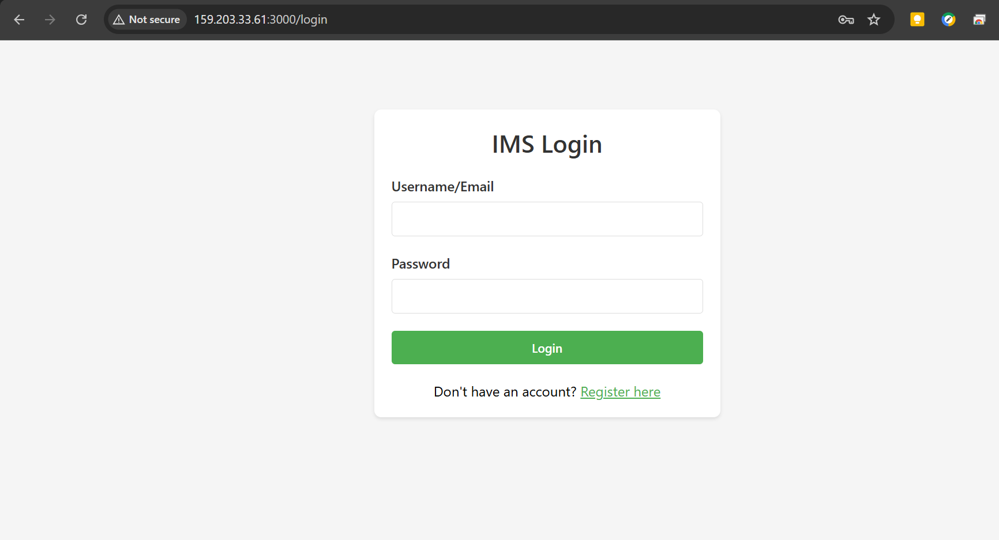
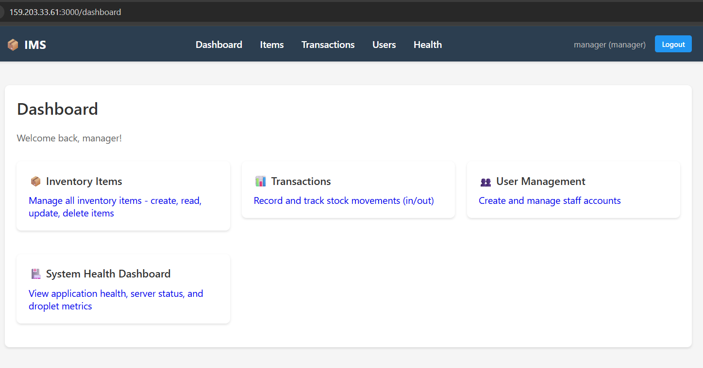
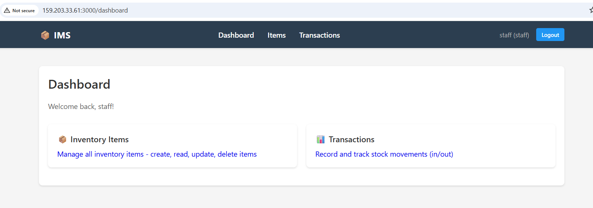
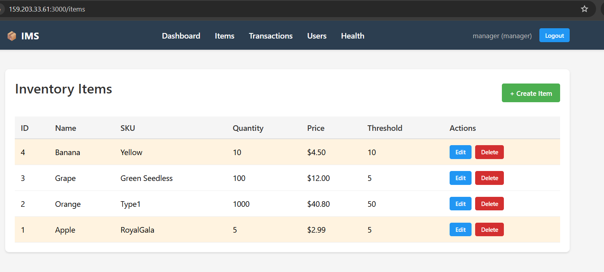
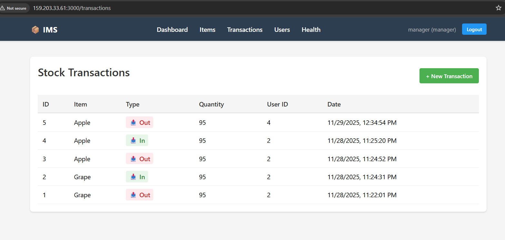
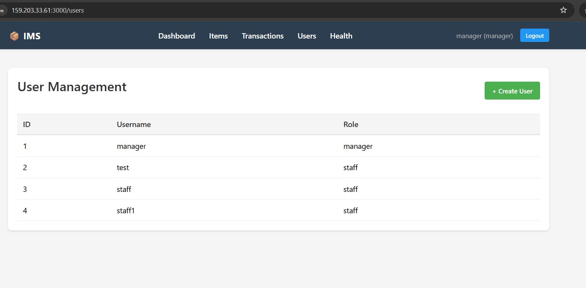
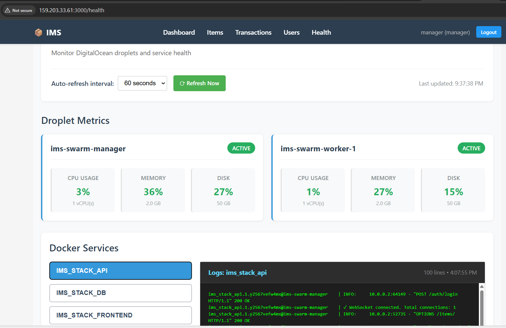

# Inventory Management System (IMS)

**ECE1779 Final Project - Cloud Computing**

---

## Table of Contents

1. [Team Information](#team-information)
2. [Motivation](#motivation)
3. [Objectives](#objectives)
4. [Technical Stack](#technical-stack)
5. [Features](#features)
   - [Core Requirements](#core-requirements)
   - [Advanced Features](#advanced-features)
6. [User Guide](#user-guide)
7. [Development Guide](#development-guide)
8. [Deployment Information](#deployment-information)
9. [Video Demo](#video-demo)
10. [Individual Contributions](#individual-contributions)
11. [Lessons Learned and Concluding Remarks](#lessons-learned-and-concluding-remarks)

---

## Team Information

| Name | Student Number | Email | GitHub |
|------|----------------|-------|--------|
| Mahta Miandashti | 1010790770 | mahta.miandashti@mail.utoronto.ca | [@maahtami](https://github.com/maahtami) |
| Zhao Ji Wang | 1005915529 | zhaoji.wang@mail.utoronto.ca | [@PeterKing1992](https://github.com/PeterKing1992) |
| Tharun Seshachalam | 1010811383 | tharun.seshachalam@mail.utoronto.ca | [@tharunks](https://github.com/tharunks) |


---

## Motivation

Effective inventory management is essential for organizations that rely on physical goods such as retail stores, laboratories, warehouses, and educational departments. Many small and medium-sized organizations still manage their stock manually using spreadsheets or outdated desktop software. These methods are prone to human error, lack real-time synchronization, and provide limited visibility into stock changes across users or locations.

In settings where supplies move quickly—like lab consumables, classroom materials, or small retail items—delayed updates or duplicate entries can cause shortages, oversupply, and loss of accountability. Traditional inventory systems are often expensive, complex, or lack modern cloud capabilities, making them unsuitable for teams that need collaboration and accessibility from multiple locations.

### The Problem We're Solving

The Inventory Management System (IMS) addresses these problems by providing a **cloud-native, real-time, and collaborative platform** for tracking inventory levels and stock movements. It includes secure, role-based access so that managers and staff can work efficiently without data conflicts. Managers can monitor stock levels, review trends, and receive automatic alerts for low-stock items, while staff can record and update inventory in real time.

### Why This Project Matters

This project is worth pursuing because it demonstrates how cloud computing principles can be applied to solve a practical and common business problem. The system uses containerization, orchestration, persistent storage, and edge deployment to ensure reliability, scalability, and performance. By deploying the application on DigitalOcean using Docker Swarm, the system benefits from distributed deployment that delivers reliable service for teams across different locations.

### Target Users

The target users are primarily **small to medium business owners and staff** in industries that require frequent tracking of physical inventory/stock, such as:
- Laboratory technicians managing consumables
- Retail store managers tracking merchandise
- Warehouse staff monitoring shipments
- Educational institutions managing equipment and supplies

### Value Proposition

The proposed solution provides a **cost-effective, lightweight, and scalable tool** for organizations that need an efficient way to manage their inventory. It also aligns closely with the course's learning objectives by showcasing the use of Docker, Swarm orchestration, PostgreSQL, monitoring, and serverless functions in building a stateful cloud application.

---

## Objectives

The primary objectives of this project are:

1. **Real-Time Inventory Tracking**: Enable multiple users to simultaneously view and update inventory levels with instant synchronization across all connected clients using WebSocket technology.

2. **Role-Based Access Control**: Implement secure authentication and authorization with two distinct user roles (Manager and Staff), ensuring proper separation of privileges and responsibilities.

3. **Automated Alerting**: Provide automatic low-stock notifications through both in-app alerts and email notifications to prevent inventory shortages.

4. **Cloud-Native Deployment**: Demonstrate proficiency in containerization and orchestration by deploying a multi-service application on DigitalOcean using Docker Swarm.

5. **Persistent State Management**: Ensure data durability and consistency using PostgreSQL with persistent volume storage that survives container restarts and redeployments.

6. **Monitoring and Observability**: Integrate system health monitoring and observability features to track application performance, resource utilization, and service status.

7. **Scalability and High Availability**: Design the system to support horizontal scaling and service replication for handling increased load and ensuring continuous availability.

8. **Modern Development Practices**: Apply industry-standard development workflows including CI/CD pipelines, automated testing, and infrastructure as code.

---

## Technical Stack

### Orchestration Approach
- **Docker Swarm Mode**
  - Multi-node cluster deployment (1 manager + 1 worker nodes)
  - Service replication and load balancing
  - Built-in service discovery and health checks

### Core Technologies

| Component | Technology | Version | Purpose |
|-----------|-----------|---------|---------|
| **Frontend** | React | 18.2.0 | Single-page application with responsive UI |
| **Backend** | FastAPI | Latest | RESTful API with async capabilities |
| **Database** | PostgreSQL | 18.0 | Relational data persistence |
| **State Management** | Zustand | 4.4.1 | Client-side state management |
| **Authentication** | JWT + bcrypt | Latest | Secure token-based authentication |
| **API Client** | Axios | 1.5.0 | HTTP client for API requests |
| **Real-time Communication** | WebSocket | Native | Bidirectional real-time updates |
| **Email Service** | SendGrid | 7.7.0 | Transactional email delivery |
| **Containerization** | Docker | Latest | Application packaging and isolation |
| **Orchestration** | Docker Swarm | Latest | Multi-container orchestration |
| **Web Server** | Uvicorn | Latest | ASGI web server for FastAPI |
| **Persistent Storage** | DigitalOcean Volumes | - | Block storage for database persistence |
| **Container Registry** | Docker Hub | - | Image storage and distribution |
| **CI/CD** | GitHub Actions | - | Automated build and deployment |
| **Serverless Platform** | DigitalOcean Functions | - | Serverless email notifications |

### Infrastructure

- **Cloud Provider**: DigitalOcean (IaaS)
- **Compute**: 2 Droplets (Ubuntu 20.04)
  - 1 Manager Node
  - 1 Worker Node
- **Storage**: DigitalOcean Block Storage Volume (mounted to manager node)
- **Networking**: Docker overlay network for inter-service communication
- **Monitoring**: DigitalOcean metrics API + custom health dashboard

---

## Features

### Core Requirements

#### 1. Containerization and Local Development ✅

**Implementation**: Full Docker containerization with multi-container orchestration.

- **Docker Images**: Separate Dockerfiles for backend (`app/Dockerfile`), frontend (`frontend/Dockerfile`), and database (`infra/db/Dockerfile`)
- **Docker Compose**: `docker-compose.yml` file for local development with three services:
  - Database service with PostgreSQL 18.0
  - Backend API service with FastAPI
  - Frontend service with React
- **Multi-stage Builds**: Optimized Docker images using multi-stage builds to reduce image size
- **Health Checks**: Database service includes health checks to ensure proper startup order
- **Network Isolation**: All services communicate through a dedicated Docker bridge network

**Usage**:
```bash
docker compose build --build-arg REACT_APP_API_URL=http://localhost:8000
docker compose up -d
```

#### 2. State Management ✅

**Implementation**: PostgreSQL database with persistent storage and proper schema management.

- **Database**: PostgreSQL 18.0 with three core tables:
  - `users`: User accounts with role-based access (manager/staff)
  - `items`: Inventory items with SKU, quantity, and low-stock thresholds
  - `transactions`: Stock movement records (IN/OUT transactions)
- **Persistent Storage**: 
  - **Local Development**: Docker named volume (`ims_pg_data`) for data persistence
  - **Production**: DigitalOcean Block Storage Volume (50GB) mounted to `/mnt/imsdbdata` on the manager node
- **Data Initialization**: Automated schema creation using SQL scripts in `infra/db/init/001_schema.sql`
- **Connection Pooling**: SQLAlchemy ORM with connection pooling for efficient database access
- **Data Integrity**: Foreign key constraints and CASCADE deletes ensure referential integrity

**Database Schema**:
```sql
-- Users table with role-based access
CREATE TABLE users (
  id SERIAL PRIMARY KEY,
  username VARCHAR(100) UNIQUE NOT NULL,
  email VARCHAR(255) UNIQUE NOT NULL,
  hashed_password TEXT NOT NULL,
  role VARCHAR(20) NOT NULL DEFAULT 'staff' CHECK (role IN ('manager','staff')),
  created_at TIMESTAMPTZ DEFAULT NOW()
);

-- Items table for inventory
CREATE TABLE items (
  id SERIAL PRIMARY KEY,
  name VARCHAR(100) NOT NULL,
  sku VARCHAR(100) UNIQUE NOT NULL,
  quantity INTEGER NOT NULL DEFAULT 0,
  low_stock_threshold INTEGER NOT NULL DEFAULT 5,
  price FLOAT NOT NULL DEFAULT 0.0,
  updated_at TIMESTAMPTZ NOT NULL DEFAULT NOW()
);

-- Transactions table for stock movements
CREATE TABLE transactions (
  id SERIAL PRIMARY KEY,
  user_id INTEGER NOT NULL REFERENCES users(id) ON DELETE CASCADE,
  item_id INTEGER NOT NULL REFERENCES items(id) ON DELETE CASCADE,
  quantity INTEGER NOT NULL,
  type VARCHAR(20) NOT NULL CHECK (type IN ('IN', 'OUT')),
  created_at TIMESTAMPTZ DEFAULT NOW()
);
```

#### 3. Deployment Provider ✅

**Implementation**: Full deployment on DigitalOcean infrastructure.

- **Infrastructure-as-a-Service (IaaS)**: Three Ubuntu 20.04 droplets
  - Manager node: `ims-swarm-manager` (159.203.33.61)
  - Worker node 1: `ims-swarm-worker-1`
- **Block Storage**: 50GB DigitalOcean Volume attached to manager node for database persistence
- **Container Registry**: Docker Hub (`tksdock/ece1779`) for image storage and distribution
- **Serverless Functions**: DigitalOcean Functions for email notification service

#### 4. Orchestration Approach: Docker Swarm Mode ✅

**Implementation**: Multi-node Docker Swarm cluster with service replication and load balancing.

**Swarm Cluster Configuration**:
- **Manager Node**: 1 node (hosts database due to volume constraint and backend service due to docker socket access for health dashboard)
- **Worker Nodes**: 1 node (run frontend)
- **Service Replication**:
  - Database: 1 replica (constrained to manager node)
  - Backend API: 1 replica (constrained to manager for Docker socket access)
  - Frontend: 3 replicas (distributed across nodes)

**Stack Deployment** (`docker-stack.yml`):
```yaml
services:
  db:
    image: tksdock/ece1779:ims-db-v1.0
    volumes:
      - type: bind
        source: /mnt/imsdbdata
        target: /var/lib/postgresql
    deploy:
      replicas: 1
      placement:
        constraints:
          - node.hostname == ims-swarm-manager

  api:
    image: tksdock/ece1779:ims-backend-v1.0
    ports:
      - "8000:8080"
    deploy:
      replicas: 1
      placement:
        constraints:
          - node.hostname == ims-swarm-manager

  frontend:
    image: tksdock/ece1779:ims-frontend-cloud-v1.0
    ports:
      - "3000:3000"
    deploy:
      replicas: 3
```

**Key Features**:
- **Service Discovery**: Automatic DNS-based service discovery
- **Load Balancing**: Built-in ingress load balancing for frontend replicas
- **Health Monitoring**: Automatic health checks and service restart on failure
- **Rolling Updates**: Zero-downtime deployments with rolling update strategy
- **Overlay Networking**: Secure inter-service communication across nodes

**Deployment Commands**:
```bash
# Initialize Swarm on manager
docker swarm init

# Join workers (on each worker node)
docker swarm join --token <TOKEN> <MANAGER_IP>:2377

# Deploy stack
docker stack deploy -c docker-stack.yml ims_stack

# Scale services
docker service scale ims_stack_frontend=3

# Monitor services
docker service ls
docker service ps ims_stack_api
```

#### 5. Monitoring and Observability ✅

**Implementation**: Custom System Health Dashboard integrated with DigitalOcean metrics API.

**Manager-Only Dashboard Features**:

1. **System Metrics**:
   - CPU usage, memory utilization, disk I/O
   - Real-time metric collection from DigitalOcean API
   - Historical trend visualization

2. **Droplet Monitoring**:
   - Multiple droplet tracking via environment configuration
   - CPU, memory, and disk metrics per droplet
   - Network I/O statistics

3. **Service Log Aggregation**:
   - Real-time Docker service logs for:
     - `ims_stack_api` (backend)
     - `ims_stack_db` (database)
     - `ims_stack_frontend` (frontend)
   - Last 100 log entries per service
   - Terminal-style log viewer with timestamps

4. **Polling Mechanism**:
   - 30-second automatic refresh
   - Manual refresh capability
   - Near-real-time metric updates

**Implementation Details**:
- **Backend Endpoint**: `/health/*` routes (manager-only access)
- **Frontend Component**: `SystemHealth.js` with polling logic
- **API Integration**: DigitalOcean metrics API v2
- **Docker Integration**: Docker socket access for log retrieval

**Configuration** (`.env`):
```bash
DIGITALOCEAN_TOKEN=your-api-token
DIGITALOCEAN_DROPLET_IDS=12345,67890,11111
```

**Access**: Manager role required - http://159.203.33.61:3000/health

---

### Advanced Features

#### 1. Real-Time Updates Using WebSockets ✅

**Implementation**: Full-duplex WebSocket communication for instant updates across all connected clients.

**Features**:
- **Global WebSocket Connection**: Shared WebSocket instance across all React components
- **Automatic Reconnection**: 3-second retry on connection loss
- **Event Broadcasting**: Server-side broadcast to all connected clients
- **Event Types**:
  - `item_created`: New inventory item added
  - `item_updated`: Item quantity or details changed
  - `item_deleted`: Item removed from inventory
  - `transaction_created`: New stock movement recorded
  - `low_stock_alert`: Item quantity below threshold

**Technical Implementation**:

*Backend* (`app/services/websocket_manager.py`):
```python
class WebSocketManager:
    def __init__(self):
        self.active_connections: set[WebSocket] = set()
    
    async def connect(self, websocket: WebSocket):
        await websocket.accept()
        self.active_connections.add(websocket)
    
    async def broadcast(self, message: dict):
        for connection in self.active_connections.copy():
            try:
                await connection.send_json(message)
            except Exception:
                self.active_connections.discard(connection)
```

*Frontend* (`frontend/src/hooks/useWebSocket.js`):
```javascript
// Global WebSocket with automatic reconnection
function connectGlobalWebSocket() {
  const wsUrl = `ws://${backendHost}/ws`;
  globalWs = new WebSocket(wsUrl);
  
  globalWs.onmessage = (event) => {
    const message = JSON.parse(event.data);
    notifyListeners(message);
  };
  
  globalWs.onclose = () => {
    setTimeout(connectGlobalWebSocket, 3000);
  };
}
```

**Benefits**:
- Zero refresh required for inventory updates
- Instant notification of stock changes
- Collaborative real-time editing
- Reduced API polling overhead

#### 2. Serverless Integration Using DigitalOcean Functions ✅

**Implementation**: DigitalOcean Functions for email notifications using SendGrid API.

**Architecture**:
- **Platform**: DigitalOcean Functions (OpenWhisk-based)
- **Runtime**: Node.js 18
- **Trigger**: HTTP POST request
- **Email Provider**: SendGrid API

**Function Structure**:
```
serverless/
├── project.yml                 # Function configuration
└── packages/
    └── serverless-fn/
        └── send-email/
            ├── index.js        # Function handler
            └── package.json    # Dependencies
```

**Function Handler** (`index.js`):
```javascript
exports.main = async function(args) {
  // Validate HTTP method
  if (args.__ow_method !== 'POST') {
    return { statusCode: 405, body: 'Method not allowed' };
  }
  
  // Authenticate request
  const authHeader = args.__ow_headers['authorization'];
  if (!authHeader || token !== API_KEY) {
    return { statusCode: 401, body: 'Unauthorized' };
  }
  
  // Send email via SendGrid
  await sgMail.send({
    to: process.env.TO_EMAIL,
    from: process.env.SENDER_EMAIL,
    subject: args.subject,
    text: args.text
  });
  
  return { statusCode: 200, body: 'Email sent' };
}
```

**Integration Flow**:
1. Backend detects low stock condition
2. Backend sends HTTP POST to serverless function
3. Function authenticates request using API key
4. Function sends email via SendGrid
5. Backend logs response status

**Deployment**:
```bash
cd serverless/packages/serverless-fn/send-email/
npm install @sendgrid/mail
cd ../../../../
doctl serverless deploy serverless
```

**Configuration** (`project.yml`):
```yaml
environment:
  SENDGRID_API_KEY: ${SENDGRID_API_KEY}
  API_KEY: ${API_KEY}
  SENDER_EMAIL: ${SENDER_EMAIL}
  TO_EMAIL: ${TO_EMAIL}
```

#### 3. External Integration with SendGrid for Email Notifications ✅

**Implementation**: SendGrid API integration for transactional email delivery.

**Use Case**: Automated low-stock alerts sent to management when inventory items fall below threshold.

**Email Trigger Logic** (`app/routers/transactions.py`):
```python
# After creating transaction and updating stock
if is_low_stock:
    # Broadcast WebSocket alert
    await manager.broadcast({
        "type": "low_stock_alert",
        "data": {
            "item_id": item.id,
            "name": item.name,
            "quantity": item.quantity,
            "threshold": item.low_stock_threshold
        }
    })
    
    # Send email via serverless function
    response = requests.post(
        os.environ.get('SERVERLESS_EMAIL_URL'),
        headers={
            "Authorization": f"Bearer {os.environ.get('EMAIL_API_KEY')}",
            "Content-Type": "application/json"
        },
        json={
            "subject": f"Low Stock Alert - {item.name}",
            "text": f"⚠️ Low stock: {item.name} ({item.sku}) has only {item.quantity} left!"
        }
    )
```

**Email Template**:
- **Subject**: "Low Stock Alert - [Item Name]"
- **Body**: Alert message with item details, current quantity, and SKU
- **Sender**: Configured sender email (verified in SendGrid)
- **Recipient**: Management email address

**SendGrid Configuration**:
- **API Key**: Stored in environment variable
- **Verified Sender**: Required for email delivery
- **Rate Limiting**: Handled by SendGrid tier limits

#### 4. CI/CD Pipeline for Deployment to Droplet Swarm ✅

**Implementation**: GitHub Actions workflow for automated build and deployment.

**Pipeline Features**:
- **Trigger**: Automatic on push to `master` branch or manual dispatch
- **Build Process**: Multi-stage Docker image builds
- **Image Registry**: Push to Docker Hub
- **Deployment**: SSH into manager node and deploy stack
- **Zero Downtime**: Rolling update strategy

**Workflow File** (`.github/workflows/deploy.yml`):
```yaml
name: Deploy to DigitalOcean Swarm

on:
  push:
    branches: [master]
  workflow_dispatch:

jobs:
  deploy:
    runs-on: ubuntu-latest
    steps:
      - name: Checkout code
        uses: actions/checkout@v3

      - name: Log in to Docker Hub
        run: echo ${{ secrets.DOCKER_PASSWORD }} | docker login -u peterthegreat1992 --password-stdin

      - name: Build and push ims-db image
        run: |
          docker build -t ims-db:v1 ./infra/db
          docker tag ims-db:v1 tksdock/ece1779:ims-db-v1.0
          docker push tksdock/ece1779:ims-db-v1.0

      - name: Build and push ims-backend image
        run: |
          docker build -t ims-backend:v1 ./app
          docker tag ims-backend:v1 tksdock/ece1779:ims-backend-v1.0
          docker push tksdock/ece1779:ims-backend-v1.0

      - name: Build and push ims-frontend image
        run: |
          docker build -t ims-frontend:cloud-v1 --build-arg REACT_APP_API_URL=http://159.203.33.61:8000 ./frontend
          docker tag ims-frontend:cloud-v1 tksdock/ece1779:ims-frontend-cloud-v1.0
          docker push tksdock/ece1779:ims-frontend-cloud-v1.0

      - name: SSH into manager node and deploy
        uses: appleboy/ssh-action@v0.1.10
        with:
          host: 159.203.33.61
          username: root
          key: ${{ secrets.deploy_key }}
          script: |
            cd ece1779
            wget https://raw.githubusercontent.com/maahtami/ece1779/master/docker-stack.yml -O docker-stack.yml
            docker stack deploy -c docker-stack.yml ims_stack
```

**Secrets Configuration**:
- `DOCKER_PASSWORD`: Docker Hub authentication
- `deploy_key`: SSH private key for manager node access

**Benefits**:
- Automated deployment on code changes
- Consistent build process
- Version-controlled infrastructure
- Audit trail of deployments

#### 5. Automated DigitalOcean Volume Snapshot Backup Using GitHub Actions ✅

**Implementation**: Scheduled GitHub Actions workflow for automated database backups.

**Backup Strategy**:
- **Frequency**: Weekly (every Sunday at 3:00 AM UTC)
- **Method**: DigitalOcean Volume snapshots
- **Retention**: Managed by DigitalOcean (manual cleanup)
- **Manual Trigger**: Available via GitHub Actions UI

**Workflow File** (`.github/workflows/volume_snapshot.yml`):
```yaml
name: DigitalOcean Volume Backup Snapshot

on:
  schedule:
    - cron: '0 3 * * 0'  # Weekly on Sunday at 3:00 AM UTC
  workflow_dispatch:      # Manual trigger

jobs:
  create_volume_snapshot:
    runs-on: ubuntu-latest
    
    env:
      DO_VOLUME_ID: '05627211-c514-11f0-a7f7-0a58ac14ec3d'
      SNAPSHOT_NAME: "imsdbdata-auto-volume-snapshot-$(date +'%Y-%m-%d-%H%M')"

    steps:
      - name: Install DigitalOcean CLI (doctl)
        uses: digitalocean/action-doctl@v2
        with:
          token: ${{ secrets.DO_VOL_SNAP_ACCESS_TOKEN }}

      - name: Create Volume Snapshot
        run: |
          doctl compute volume snapshot ${{ env.DO_VOLUME_ID }} \
            --snapshot-name ${{ env.SNAPSHOT_NAME }} \
            --format ID,Name,CreatedAt
```

**Snapshot Naming**: `imsdbdata-auto-volume-snapshot-YYYY-MM-DD-HHMM`

**Benefits**:
- Point-in-time recovery capability
- Protection against data loss
- Disaster recovery preparation
- Automated backup process

---

## User Guide

This section provides step-by-step instructions for using the Inventory Management System.

### Accessing the Application

**Production/Deployment URL**: http://159.203.33.61:3000

### User Roles

The system supports two user roles with different permissions:

1. **Manager** (Admin):
   - Full access to all features
   - User management capabilities
   - System health monitoring
   - Item management (create, edit, delete)
   - Transaction management

2. **Staff** (Regular User):
   - View inventory items
   - Create transactions (stock in/out)
   - View transaction history
   - Receive real-time updates

### Getting Started

#### 1. User Registration and Login

**Registration**:
1. Navigate to http://159.203.33.61:3000
2. Click "Register here" link on the login page
3. Enter username and password
4. Click "Register" button
5. New users are created with "staff" role by default


*Figure 2: Staff registration page*

**Login**:
1. Enter your username and password
2. Click "Login" button
3. Upon successful authentication, you'll be redirected to the Dashboard


*Figure 1: Login page with username and password fields*

**Default Admin Account**:
- **Username**: manager
- **Password**: Credentials sent to TA
- **Role**: manager

#### 2. Dashboard Overview

The Dashboard serves as the main navigation hub with quick access cards:

- **📦 Inventory Items**: Manage all inventory items
- **📊 Transactions**: Record and track stock movements
- **👥 User Management** (Manager only): Create and manage staff accounts
- **🏥 System Health Dashboard** (Manager only): Monitor system performance


*Figure 3: Manager dashboard with quick access cards*


*Figure 4: Staff dashboard view*

#### 3. Managing Inventory Items

**Viewing Items**:
1. Click "Items" in the navigation bar or "Inventory Items" card on Dashboard
2. View complete list of inventory items with:
   - Item name and description
   - SKU (Stock Keeping Unit)
   - Current quantity
   - Price
   - Last updated timestamp


*Figure 5: Inventory items list with actions*

**Creating a New Item**:
1. Navigate to Items page
2. Click "Create New Item" button
3. Fill in the form:
   - **Name**: Item name (required)
   - **Description**: Item details (optional)
   - **SKU**: Unique identifier (required)
   - **Quantity**: Initial stock quantity (default: 0)
   - **Low Stock Threshold**: Alert trigger level (default: 5)
   - **Price**: Item price (default: 0.0)
4. Click "Create Item" button
5. Success notification appears
6. New item appears in the list (real-time update via WebSocket)

**Editing an Item**:
1. Locate the item in the Items list
2. Click "Edit" button for that item
3. Modify desired fields
4. Click "Update Item" button
5. Changes are saved and broadcast to all users

**Deleting an Item**:
1. Locate the item in the Items list
2. Click "Delete" button
3. Confirm deletion in the dialog
4. Item is removed and all users are notified

#### 4. Recording Transactions

Transactions represent stock movements (incoming shipments or outgoing sales/usage).

**Creating a Transaction**:
1. Navigate to "Transactions" page
2. Click "Create New Transaction" button
3. Fill in the form:
   - **Item**: Select from dropdown (shows item name and current quantity)
   - **Transaction Type**: 
     - **IN**: Adding stock (receiving shipment)
     - **OUT**: Removing stock (sale or usage)
   - **Quantity**: Number of units to move
4. Click "Create Transaction" button
5. System validates:
   - For OUT transactions: Ensures sufficient stock available
   - Updates item quantity automatically
   - Checks for low-stock condition
6. Transaction is recorded and all users see updated quantities in real-time

**Viewing Transaction History**:
1. Navigate to "Transactions" page
2. View chronological list of all transactions (newest first)
3. Each entry shows:
   - Transaction type (IN/OUT with color coding)
   - Item name
   - Quantity moved
   - User who performed the transaction
   - Timestamp


*Figure 6: Transaction history with filters*

**Low Stock Alerts**:
- When an OUT transaction causes quantity to fall below threshold:
  - Real-time alert displayed to all connected users
  - Email notification sent to management
  - Alert shows item name, current quantity, and SKU


*Figure 7: Low stock alert banner on items page*

#### 5. User Management (Manager Only)

**Viewing Users**:
1. Navigate to "Users" page
2. View list of all registered users
3. Each entry shows:
   - Username
   - Email address
   - Role (manager/staff)
   - Account creation date


*Figure 8: User management table for managers*

**Creating a New User**:
1. Click "Create New User" button
2. Fill in the form:
   - **Username**: Unique username (required)
   - **Password**: User password (required)
   - **Role**: Select manager or staff
3. Click "Create User" button
4. New user can immediately log in with provided credentials

**Note**: Users cannot be deleted through the UI to maintain audit trail integrity.

#### 6. System Health Dashboard (Manager Only)

**Accessing Health Dashboard**:
1. Navigate to "Health" in the navigation bar
2. Dashboard automatically loads metrics
3. Auto-refresh every 30 seconds

**Dashboard Sections**:

**System Metrics**:
- CPU usage percentage
- Memory utilization (used/total)
- Disk I/O statistics

**Droplet Metrics**:
- Individual droplet information
- Per-droplet resource usage
- Network I/O statistics

**Service Logs**:
- Real-time logs from Docker services
- Terminal-style log viewer
- Last 100 entries per service
- Tabs for each service:
  - `ims_stack_api`: Backend API logs
  - `ims_stack_db`: Database logs
  - `ims_stack_frontend`: Frontend logs


*Figure 9: Health dashboard with metrics and logs*

**Manual Refresh**:
- Click "Refresh" button to update metrics immediately
- Useful for checking recent changes

#### 7. Real-Time Updates

The system uses WebSocket technology for instant updates across all connected clients.

**What Updates in Real-Time**:
- New items added to inventory
- Item quantity changes after transactions
- Item edits and deletions
- New transactions recorded
- Low stock alerts

**Connection Status**:
- Check browser console for WebSocket connection status
- Automatic reconnection on connection loss
- No user action required

**Benefits**:
- No page refresh needed
- Multiple users can work simultaneously
- Instant visibility of changes
- Collaborative inventory management

#### 8. Logging Out

1. Click your username in the navigation bar
2. Click "Logout" button
3. Session is cleared
4. Redirected to login page

---

## Development Guide

This section provides instructions for setting up the development environment and deploying the application.

### Prerequisites

- Docker and Docker Compose installed
- Git for version control
- Node.js 18+ (for local frontend development)
- Python 3.9+ (for local backend development)
- DigitalOcean account (for production deployment)
- Docker Hub account (for image registry)
- SendGrid account (for email notifications)

### Environment Setup

#### 1. Clone the Repository

```bash
git clone https://github.com/maahtami/ece1779.git
cd ece1779
```

#### 2. Environment Variables (Credentials sent to TA)

Create a `.env` file in the root directory with the following variables:

```bash
# Database Configuration
POSTGRES_DB=ims
POSTGRES_USER=ims_user
POSTGRES_PASSWORD=your_secure_password

# Admin User (created on first startup)
ADMIN_USERNAME=admin
ADMIN_PASSWORD=admin123

# Email Service
SERVERLESS_EMAIL_URL=https://your-function-url.doserverless.co/api/v1/web/fn-xxx/serverless-fn/send-email
EMAIL_API_KEY=your-email-api-key

# DigitalOcean Metrics (for System Health Dashboard)
DIGITALOCEAN_TOKEN=your-digitalocean-api-token
DIGITALOCEAN_DROPLET_IDS=12345,67890,11111

# Frontend (for Docker Compose build)
REACT_APP_API_URL=http://localhost:8000
```

**Important Notes**:
- Change default passwords in production
- Keep `.env` file out of version control (already in `.gitignore`)
- Use strong passwords and API keys

#### 3. Create `.env` for Serverless Function (Credentials sent to TA)

Create `serverless/.env`:

```bash
SENDGRID_API_KEY=your-sendgrid-api-key
API_KEY=your-email-function-api-key
SENDER_EMAIL=alerts@yourdomain.com
TO_EMAIL=manager@yourdomain.com
```

### Local Development and Testing

#### Using Docker Compose

This is the recommended approach for local development as it closely mirrors the production environment.

**1. Build and Start Services**:

```bash
# Build images with local API URL
docker compose build --build-arg REACT_APP_API_URL=http://localhost:8000

# Start all services in detached mode
docker compose up -d
```

**2. Verify Services**:

```bash
# Check running containers
docker compose ps

# View logs
docker compose logs -f api      # Backend logs
docker compose logs -f frontend # Frontend logs
docker compose logs -f db       # Database logs
```

**3. Access the Application**:

- Frontend: http://localhost:3000
- Backend API: http://localhost:8000
- API Documentation: http://localhost:8000/docs (Swagger UI)

**4. Database Access**:

```bash
# Connect to PostgreSQL
docker compose exec db psql -U ims_user -d ims

# Common queries
\dt                              # List tables
SELECT * FROM users;             # View users
SELECT * FROM items;             # View items
SELECT * FROM transactions;      # View transactions
```

**5. Stop Services**:

```bash
# Stop containers (preserves data)
docker compose down

# Stop and remove volumes (deletes data)
docker compose down -v
```

### Testing Local Swarm Mode

Test Docker Swarm orchestration on your local machine before production deployment.

**1. Initialize Swarm**:

```bash
docker swarm init
```

**2. Build and Push Images**:

```bash
# Build database image
docker build -t ims-db:v1 ./infra/db
docker tag ims-db:v1 tksdock/ece1779:ims-db-v1.0
docker push tksdock/ece1779:ims-db-v1.0

# Build backend image
docker build -t ims-backend:v1 ./app
docker tag ims-backend:v1 tksdock/ece1779:ims-backend-v1.0
docker push tksdock/ece1779:ims-backend-v1.0

# Build frontend image (local URL)
docker build -t ims-frontend:v1 --build-arg REACT_APP_API_URL=http://localhost:8000 ./frontend
docker tag ims-frontend:v1 tksdock/ece1779:ims-frontend-v1.0
docker push tksdock/ece1779:ims-frontend-v1.0
```

**3. Deploy Stack**:

```bash
# Deploy using local stack file
docker stack deploy -c docker-stack-local.yml ims_stack
```

**4. Monitor Services**:

```bash
# List services
docker service ls

# Check service logs
docker service logs ims_stack_api
docker service logs ims_stack_db
docker service logs ims_stack_frontend

# View service tasks (containers)
docker service ps ims_stack_api

# Scale frontend service
docker service scale ims_stack_frontend=3
```

**5. Remove Stack**:

```bash
docker stack rm ims_stack
```

### Production Deployment on DigitalOcean

#### Infrastructure Setup

**1. Create Droplets**:

Create two Ubuntu 20.04 droplets in DigitalOcean:
- `ims-swarm-manager` (2GB RAM, 2 vCPUs)
- `ims-swarm-worker-1` (2GB RAM, 2 vCPUs)

**2. Setup Manager Node**:

SSH into the manager droplet:

```bash
ssh root@159.203.33.61
```

Run the setup script:

```bash
# Copy setup-manager.sh to the droplet
# Then run:
chmod +x setup-manager.sh
./setup-manager.sh
```

This script:
- Installs Docker
- Initializes Docker Swarm
- Outputs join token for worker nodes

**3. Setup Worker Nodes**:

SSH into worker droplet and run:

```bash
chmod +x setup-worker.sh
./setup-worker.sh

# Join the swarm (use token from manager)
docker swarm join --token <WORKER_TOKEN> <MANAGER_IP>:2377
```

**4. Create and Attach Volume**:

1. In DigitalOcean dashboard, create a new Volume:
   - Name: `imsdbdata`
   - Size: 50GB
   - Region: Same as droplets

2. Attach volume to `ims-swarm-manager`

3. Mount the volume:

```bash
# On manager node
mkdir -p /mnt/imsdbdata
mount -o discard,defaults /dev/disk/by-id/scsi-0DO_Volume_imsdbdata /mnt/imsdbdata

# Make mount permanent
echo '/dev/disk/by-id/scsi-0DO_Volume_imsdbdata /mnt/imsdbdata ext4 defaults,nofail,discard 0 0' | sudo tee -a /etc/fstab
```

#### Application Deployment

**1. Prepare Environment**:

```bash
# On manager node
git clone https://github.com/maahtami/ece1779.git
cd ece1779

# Create .env file with production values
nano .env
```

**2. Build and Push Production Images**:

```bash
# Build frontend with production API URL
docker build -t ims-frontend:cloud-v1 --build-arg REACT_APP_API_URL=http://159.203.33.61:8000 ./frontend
docker tag ims-frontend:cloud-v1 tksdock/ece1779:ims-frontend-cloud-v1.0
docker push tksdock/ece1779:ims-frontend-cloud-v1.0

# Backend and database images (same as local)
docker build -t ims-backend:v1 ./app
docker tag ims-backend:v1 tksdock/ece1779:ims-backend-v1.0
docker push tksdock/ece1779:ims-backend-v1.0

docker build -t ims-db:v1 ./infra/db
docker tag ims-db:v1 tksdock/ece1779:ims-db-v1.0
docker push tksdock/ece1779:ims-db-v1.0
```

**3. Deploy Stack**:

```bash
# On manager node
docker stack deploy -c docker-stack.yml ims_stack
```

**4. Verify Deployment**:

```bash
# Check services
docker service ls

# View logs
docker service logs ims_stack_api
docker service logs ims_stack_db
docker service logs ims_stack_frontend

# Check service status
docker service ps ims_stack_api
docker service ps ims_stack_db
docker service ps ims_stack_frontend
```

**5. Access Application**:

- Frontend: http://159.203.33.61:3000
- API: http://159.203.33.61:8000

#### Serverless Function Deployment

**1. Install doctl CLI**:

Follow instructions at: https://docs.digitalocean.com/reference/doctl/how-to/install/

**2. Authenticate doctl**:

```bash
# Generate API token in DigitalOcean dashboard
# Navigate to: API → Tokens/Keys → Generate New Token
# Select "Functions" scope

doctl auth init
# Enter your API token when prompted
```

**3. Install Dependencies**:

```bash
cd serverless/packages/serverless-fn/send-email/
npm install @sendgrid/mail
cd ../../../../
```

**4. Deploy Function**:

```bash
doctl serverless deploy serverless
```

**5. Test Function**:

```bash
# Get function URL from deployment output
curl -X POST <FUNCTION_URL> \
  -H "Content-Type: application/json" \
  -H "Authorization: Bearer <API_KEY>" \
  -d '{
    "subject": "Test Email",
    "text": "This is a test email from IMS"
  }'
```

**6. Update Backend Environment**:

Add function URL to `.env` on manager node:

```bash
SERVERLESS_EMAIL_URL=<FUNCTION_URL>
EMAIL_API_KEY=<YOUR_API_KEY>
```

Redeploy stack to apply changes:

```bash
docker stack deploy -c docker-stack.yml ims_stack
```

### CI/CD Pipeline Setup

**1. Configure GitHub Secrets**:

In your GitHub repository, navigate to Settings → Secrets and add:

- `DOCKER_PASSWORD`: Your Docker Hub password
- `deploy_key`: SSH private key for manager node access
- `DO_VOL_SNAP_ACCESS_TOKEN`: DigitalOcean API token for volume snapshots

**2. Pipeline Triggers**:

- **Automatic**: Push to `master` branch triggers deployment
- **Manual**: Use "Actions" tab → "Deploy to DigitalOcean Swarm" → "Run workflow"

**3. Monitor Deployments**:

- View pipeline status in GitHub Actions tab
- Check logs for build and deployment steps
- Verify application after deployment

### Development Workflow

**1. Feature Development**:

```bash
# Create feature branch
git checkout -b feature/new-feature

# Make changes
# Test locally using Docker Compose

# Commit and push
git add .
git commit -m "Add new feature"
git push origin feature/new-feature

# Create pull request
```

**2. Testing**:

```bash
# Run backend tests
cd app
pytest tests/

# Run frontend tests (if configured)
cd frontend
npm test
```

**3. Deployment**:

```bash
# Merge to master branch
# CI/CD pipeline automatically deploys

# Or manual deployment
git checkout master
git pull
# Follow production deployment steps
```

### Troubleshooting

**Common Issues**:

1. **Database Connection Failed**:
   - Verify database container is running: `docker compose ps`
   - Check database credentials in `.env`
   - View database logs: `docker compose logs db`

2. **WebSocket Connection Failed**:
   - Check backend API is accessible
   - Verify CORS settings in `app/main.py`
   - Check browser console for errors

3. **Frontend Can't Reach API**:
   - Verify `REACT_APP_API_URL` build argument
   - Check Docker network configuration
   - Test API directly: `curl http://localhost:8000/docs`

4. **Email Notifications Not Sent**:
   - Verify SendGrid API key is valid
   - Check serverless function logs
   - Test function directly with curl

5. **Volume Mount Failed** (Production):
   - Verify volume is attached to manager node
   - Check mount point: `df -h | grep imsdbdata`
   - Verify volume ID in `docker-stack.yml`

**Debug Commands**:

```bash
# View container logs
docker compose logs -f [service_name]

# Execute commands in container
docker compose exec api bash
docker compose exec db psql -U ims_user -d ims

# Check network connectivity
docker compose exec api ping db

# View Docker events
docker events

# Inspect service
docker service inspect ims_stack_api
```

---

## Deployment Information

### Live Application

**Production URL**: http://159.203.33.61:3000

**Default Admin Credentials**:
- Username: `manager`
- Password: Credentials sent to TA

### Infrastructure

**DigitalOcean Droplets**:
- Manager Node: `ims-swarm-manager` (159.203.33.61)
- Worker Node 1: `ims-swarm-worker-1`

**Persistent Storage**:
- DigitalOcean Volume: `imsdbdata` (50GB)
- Mount Point: `/mnt/imsdbdata` on manager node

**Container Registry**:
- Docker Hub: `tksdock/ece1779`
- Images: `ims-db-v1.0`, `ims-backend-v1.0`, `ims-frontend-cloud-v1.0`

**Serverless Function**:
- Platform: DigitalOcean Functions
- Runtime: Node.js 18
- Email Provider: SendGrid

### Service Status

**Check Service Health**:

```bash
# SSH into manager node
ssh root@159.203.33.61

# Check running services
docker service ls

# View service logs
docker service logs ims_stack_api
docker service logs ims_stack_frontend
docker service logs ims_stack_db
```

**Expected Output**:
```
ID             NAME                  MODE         REPLICAS   IMAGE
abc123         ims_stack_api         replicated   1/1        tksdock/ece1779:ims-backend-v1.0
def456         ims_stack_db          replicated   1/1        tksdock/ece1779:ims-db-v1.0
ghi789         ims_stack_frontend    replicated   3/3        tksdock/ece1779:ims-frontend-cloud-v1.0
```

### Monitoring

**System Health Dashboard**:
- Access: http://159.203.33.61:3000/health (requires manager role)
- Features: Droplet metrics, service logs, real-time monitoring

**DigitalOcean Dashboard**:
- Monitor droplet CPU, memory, disk usage
- View volume snapshots
- Check network traffic

### Backup and Recovery

**Automated Backups**:
- Weekly volume snapshots every Sunday at 3:00 AM UTC
- Managed via GitHub Actions workflow
- Snapshots stored in DigitalOcean

**Manual Backup**:

```bash
# Create volume snapshot via doctl
doctl compute volume snapshot <VOLUME_ID> --snapshot-name manual-backup-$(date +%Y%m%d)

# Or via GitHub Actions
# Navigate to: Actions → DigitalOcean Volume Backup Snapshot → Run workflow
```

**Recovery Procedure**:

1. Stop the stack: `docker stack rm ims_stack`
2. Detach current volume from manager node
3. Create new volume from snapshot
4. Attach new volume to manager node
5. Mount volume to `/mnt/imsdbdata`
6. Redeploy stack: `docker stack deploy -c docker-stack.yml ims_stack`

### Scaling

**Frontend Scaling**:

```bash
# Scale frontend to 5 replicas
docker service scale ims_stack_frontend=5

# Verify
docker service ps ims_stack_frontend
```

**Backend Scaling** (requires configuration changes):

Currently constrained to manager node for Docker socket access. To scale:
1. Use Docker API over TCP instead of socket
2. Remove placement constraint
3. Scale service: `docker service scale ims_stack_api=3`

**Database Scaling**:

Database is constrained to manager node due to volume attachment. For high availability:
1. Use managed PostgreSQL service (DigitalOcean Managed Database)
2. Remove database service from stack
3. Update connection string in backend

---

## Video Demo

- Watch the demo on YouTube: https://www.youtube.com/watch?v=rndKv8Mxv6M

---

## Individual Contributions

### Mohsen Miandashti ([@maahtami](https://github.com/maahtami))

**Primary Responsibilities**:
- System architecture and infrastructure design
- Docker Swarm cluster setup and configuration
- DigitalOcean infrastructure provisioning (droplets, volumes)
- CI/CD pipeline implementation using GitHub Actions
- Volume snapshot backup automation
- Docker orchestration files (`docker-stack.yml`, `docker-stack-local.yml`)
- Deployment scripts (`setup-manager.sh`, `setup-worker.sh`)
- Production deployment and monitoring setup

**Key Contributions**:
- Designed multi-node Docker Swarm architecture
- Configured persistent volume storage with DigitalOcean Block Storage
- Implemented automated deployment pipeline
- Set up weekly backup automation for database
- Documented deployment procedures in `Deployment_Guide.md`

### Zhao Ji Wang ([@PeterKing1992](https://github.com/PeterKing1992))

**Primary Responsibilities**:
- Backend API development using FastAPI
- Database schema design and implementation
- Authentication and authorization (JWT, bcrypt)
- WebSocket implementation for real-time updates
- Business logic and transaction management
- Low-stock alert system
- API endpoint documentation
- Backend testing

**Key Contributions**:
- Implemented RESTful API with FastAPI
- Designed PostgreSQL database schema with proper relationships
- Developed JWT-based authentication system
- Created WebSocket manager for real-time broadcasting
- Implemented transaction validation and stock management logic
- Integrated SendGrid email notifications via serverless function
- Developed low-stock alert mechanism
- CI/CD implementation


### Tharun Seshachalam ([@tharunks](https://github.com/tharunks))

**Primary Responsibilities**:
- Frontend development using React
- User interface design and implementation
- State management using Zustand
- API client implementation with Axios
- WebSocket client integration
- System Health Dashboard development
- Responsive UI/UX design
- Frontend routing and navigation

**Key Contributions**:
- Built React frontend with component-based architecture
- Implemented user authentication flow (login, register, logout)
- Created inventory management UI (items, transactions, users)
- Developed real-time WebSocket connection with automatic reconnection
- Built System Health Dashboard for monitoring droplet metrics and logs
- Integrated DigitalOcean metrics API in frontend
- Designed responsive CSS styling for all pages
- Implemented role-based UI rendering (manager vs. staff views)


### Collaborative Work

All team members contributed to:
- Project planning and architecture decisions
- Code reviews and debugging
- Integration testing across services
- Documentation (README, Deployment Guide)
- Problem-solving and troubleshooting
- Final presentation preparation

---

## Lessons Learned and Concluding Remarks

### Technical Insights

**1. Docker Swarm Orchestration**

Docker Swarm proved to be an effective orchestration solution for this project. The built-in load balancing, service discovery, and rolling updates provided enterprise-grade features with minimal configuration. However, we learned that:

- **Volume Constraints**: Block storage volumes can only be attached to a single node, requiring careful service placement constraints for stateful applications.
- **Network Overlay**: Overlay networks simplified inter-service communication but required understanding of network drivers and port publishing.
- **Scaling Limitations**: Services requiring local resources (Docker socket, mounted volumes) cannot be scaled horizontally without architectural changes.

**2. State Management and Persistence**

Ensuring data persistence across container restarts was critical:

- **Bind Mounts vs Named Volumes**: Production deployments benefit from bind mounts to external block storage, while named volumes work well for local development.
- **Database Initialization**: SQL initialization scripts executed on first container startup streamlined database setup.
- **Backup Strategy**: Automated volume snapshots provided peace of mind, though restore procedures should be tested regularly.

**3. Real-Time Communication**

WebSocket implementation added significant value to the application:

- **Global Connection**: Maintaining a single global WebSocket connection shared across React components improved efficiency and reduced server load.
- **Automatic Reconnection**: Implementing reconnection logic was essential for production resilience.
- **Broadcasting**: Server-side broadcasting to all connected clients kept all users synchronized without polling overhead.

**4. Serverless Integration**

DigitalOcean Functions integration demonstrated the power of serverless architectures:

- **Event-Driven**: Serverless functions are ideal for sporadic event-driven tasks like email notifications.
- **Cost-Effective**: Pay-per-use pricing model reduces costs compared to always-running services.
- **Challenges**: Cold starts and debugging can be more difficult than traditional services.

**5. CI/CD Pipeline**

Automated deployment via GitHub Actions significantly improved development workflow:

- **Consistency**: Every deployment follows the same process, reducing human error.
- **Speed**: Automated builds and deployments save significant time.
- **Visibility**: Deployment history and logs provide audit trail.

### Challenges Overcome

**1. WebSocket Connection Through Docker**

Initially, WebSocket connections failed in the containerized environment due to:
- CORS configuration issues
- Proxy settings in Docker networking
- Frontend hardcoded localhost URLs

**Solution**: Configured proper CORS settings in FastAPI backend and used environment variables for dynamic WebSocket URL construction.

**2. Volume Mount Permissions**

Database container failed to start due to permission issues on the mounted volume:
- DigitalOcean volume mounted with incorrect permissions
- PostgreSQL requires specific ownership

**Solution**: Set proper ownership on the mounted directory (`chown -R postgres:postgres /mnt/imsdbdata`) before container startup.

**3. Frontend API URL Configuration**

React's build-time environment variable requirements caused confusion:
- Runtime environment variables don't work with Create React App
- Different URLs needed for local vs. production

**Solution**: Used Docker build arguments (`--build-arg REACT_APP_API_URL`) to bake the correct API URL into the image at build time, creating separate images for local and cloud deployment.

**4. Serverless Function Module Loading**

DigitalOcean Functions initially failed to load the SendGrid module:
- ES modules (`import/export`) not supported without configuration
- Missing `node_modules` in deployment package

**Solution**: Converted to CommonJS (`require/exports.main`) and ensured `node_modules` was included in the deployment package.

**5. Health Dashboard Docker Socket Access**

System Health Dashboard required Docker socket access to retrieve service logs:
- Socket file not accessible from containers by default
- Security concerns with socket exposure

**Solution**: Mounted Docker socket as volume (`/var/run/docker.sock`) and constrained service to manager node to limit exposure.

### Best Practices Identified

1. **Environment Variables**: Always use environment variables for configuration—never hardcode credentials or URLs.

2. **Service Health Checks**: Define health checks in Docker Compose and Swarm for automatic failure detection and recovery.

3. **Logging**: Comprehensive logging at all levels (application, Docker, system) is essential for troubleshooting.

4. **Documentation**: Maintain detailed documentation throughout development, not as an afterthought.

5. **Incremental Testing**: Test each component individually before integration (Docker Compose → Local Swarm → Production Swarm).

6. **Security First**: Implement authentication, authorization, and secure communication from the beginning.

7. **Backup Verification**: Regularly test backup restoration procedures, not just backup creation.

### Project Achievements

**Technical Accomplishments**:
- ✅ Multi-node Docker Swarm cluster with 3 nodes
- ✅ Persistent state management with DigitalOcean volumes
- ✅ Real-time bidirectional communication with WebSockets
- ✅ Serverless integration for event-driven notifications
- ✅ Automated CI/CD pipeline with GitHub Actions
- ✅ Role-based access control with JWT authentication
- ✅ System monitoring and observability dashboard
- ✅ Automated backup strategy with volume snapshots

**Learning Outcomes**:
- Practical experience with IaaS cloud deployment
- Understanding of container orchestration complexities
- Exposure to microservices architecture patterns
- Experience with serverless computing models
- Implementation of real-time communication protocols
- DevOps practices including CI/CD and automation

### Concluding Thoughts

This project successfully demonstrated the practical application of cloud computing concepts learned in ECE1779. Building a production-ready application from scratch provided invaluable hands-on experience with:

- Infrastructure as a Service (IaaS) deployment on DigitalOcean
- Container orchestration with Docker Swarm
- Persistent state management in distributed systems
- Real-time communication protocols
- Serverless computing patterns
- DevOps automation and CI/CD
- System monitoring and observability

The Inventory Management System solves a real-world problem while showcasing modern cloud-native architecture patterns. The combination of containerization, orchestration, persistent storage, real-time updates, and serverless integration demonstrates a comprehensive understanding of cloud computing principles.

Working as a team taught us the importance of clear communication, code reviews, and documentation. Each team member brought unique skills and perspectives, and collaborative problem-solving led to better solutions than any individual could have achieved alone.

The challenges we encountered—from WebSocket connection issues to volume mount permissions—provided valuable learning experiences that will inform future projects. Understanding not just how to implement features, but why certain approaches work better than others, is the true measure of learning.

We are proud of what we accomplished and confident that the skills and knowledge gained from this project will serve us well in our future careers as software engineers and cloud architects.

---
